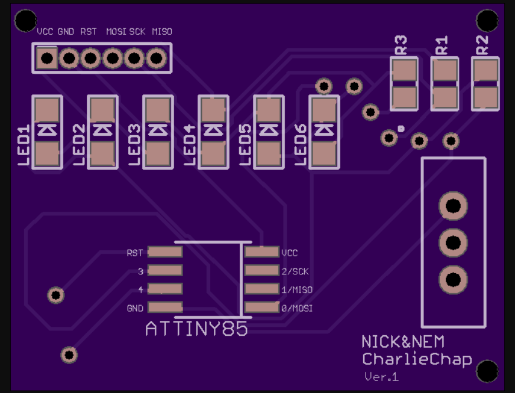

# CharliePlex Board

This board was originaly made to show my friend who is a software engineer  how to reflow electronic  componets into a PCB using a skillet. 

Originally I prototyped the circuit using : An Adafruit Arduino Board with an Attiny85 MCU (Gemma). 
Then  from Digikey Electronics I ordered some SMD components: 
* Attiny85
*  0805 LEDs 
*  0805 resistors 
* coin battery holder  

**The Build**

Wired 3 LEDs running on an Attiny85 board (Gemma) from Adafruit for power tests. 
The Arduino sketch can be modified and work with an Arduino Uno (as I have tested).

Used a breakout board to solder the fresh attiny85 to it in order to burn the arduino bootloader to it via ISP
Reflowed LEDS, resistors to the PCB along with the attiny85 with the freshly installed Arduino code 
Added the battery tested connections
 Finished!
 

